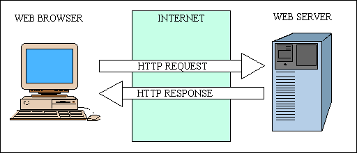

# The Internet

- The internet is essentially a large network of computers
- Clients
  - the typical Web user's Internet-connected devices

---

## Web Basics

- URL (Uniform Resource Locator)
  - Uniform: follows a uniform standard
  - This is a reference to a resource on the web
  - When we enter a URL, the corresponding resource is located
  - 3 parts: HTTP protocol `http://` and resource / host name "facebook", top-level domain: `.com` etc.
- IP address
  - four period separated numbers assigned to each computer
  - computers on same network have same external IP address but are differentiated via the router

---

## Request Response Cycle

- 
  - Client -> DNS -> Server -> Client

### 1. Request

1. Client makes a request by entering an address into the web browser
2. Domain Name Server (DNS)

- The DNS is like a phone book, instead of matching phone numbers to names, it matches IP addresses to domain names (google, yahoo, etc.)

### 2. Response

- Server receives & approves request
- Server prepares response (querying a database, executing algorithms / logic)
- Response is broken into small packets that get pieced back together
- Regardless of what back-end stack the server is using, the response will be HTML, CSS, and JavaScript

## localhost

- Web server on your own computer, hence 'local' 'host'
- Localhost is unique in that it is assigned to the loopback network interface
  - You are giving access and getting access to the hosted files on your computer
  - Your machine is both the client and the server
  - IP address is always 127.0.0.1

---

## Lecture Code Repo

- Now we'll create a github repo to store all the lecture code for this section, starting out with this file.
